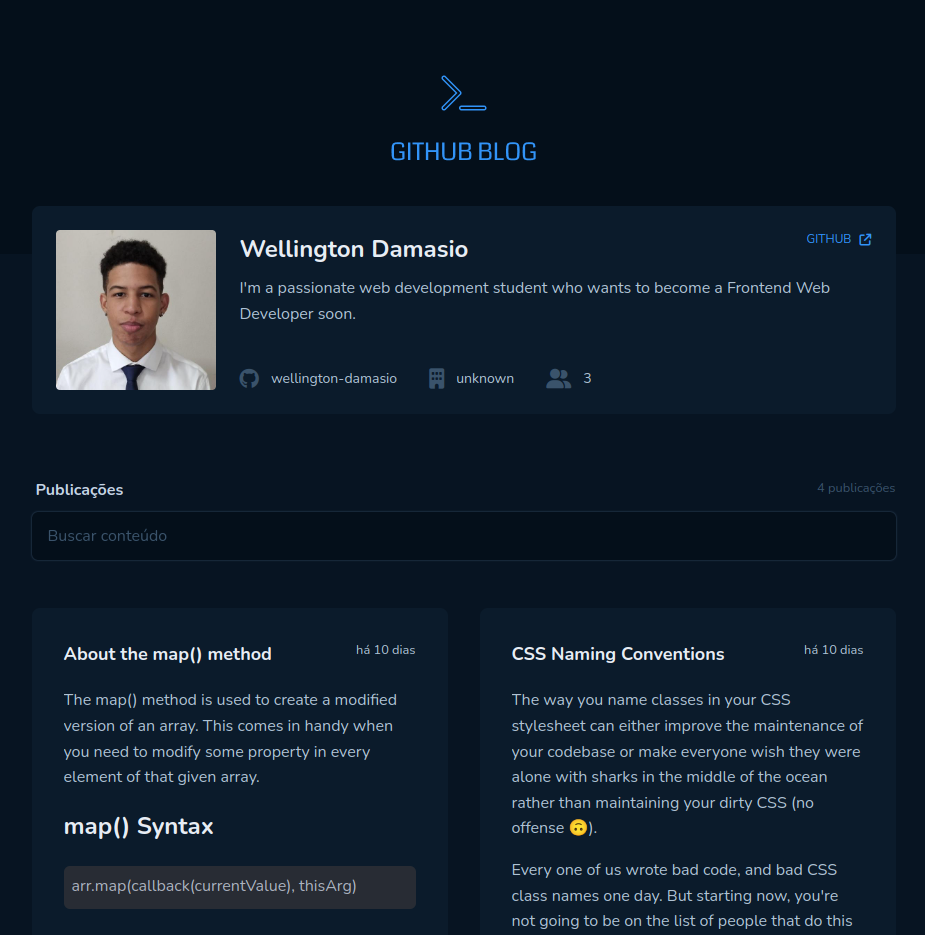
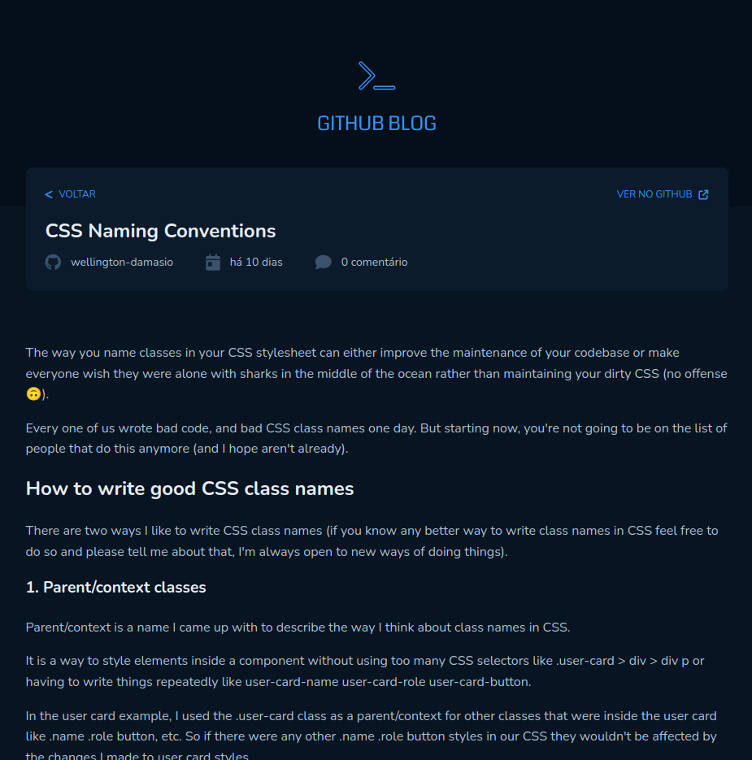

# Coffee Delivery

      |  
:-------------------------:|:-------------------------:
        
## About the project 💻
This is a challenge from the third chapter of Rocketseat's React Ignite classes.

Users should be able to:
- See list of blog posts based on the issues of a repository in GitHub
- Click in each of the blog posts and see the entire post in a new page

Tecnologies I'm using:
- Vite
- React.js
- TypeScript

Libraries:
- TailwindCSS
- react-router-dom
- Font Awesome
- Axios

Some features I added:
- Responsive design (mobile-first workflow)
- Detailed user information in the card

## Difficulties I faced 🤷‍♂️
### Consuming GitHubs API
Using octokit were generating a lot of bugs in this application and to use it with Axios I had to pass the authorization token on the headers of each request.

I didn't know I could pass header parameters to a request with Axios until I faced this problem and it took my a while to even find this out.

### React Router
I used the wrong type of Router component when building the application, so when it came the time to try consuming GitHub's API using the Routes so the post would load before the page rendered I had some problems.

### Styling Markdown
I had some issues when it came to the style of rendered markdown text to HTML code. After some research I found the right libraries to style the code tags the way I intended.

## What I learned 👨‍🏫
- How to better plan the structure (HTML), styles (CSS) and functionalities (JS) of an application by looking at a design/mockup
- How to think in a 'React way' (passing props, immutability, callback functions and etc)
- How to use TypeScript with React (still have to work in this tho)
- How to use TailwindCSS and how the concept of utility-first classes help improve the development time
- How to use react-router-dom to make a multi-page SPA 
- How to use the useEffect hook to consume API
- How to use ReactMarkdown to render markdown text to HTML code
